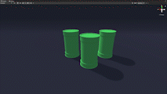

# Unity Radius Tool

<a href="https://github.com/KieronJenkins" target="_blank">
<a href="https://uk.linkedin.com/in/kieronjenkins" target="_blank">

## About
The radius tool is designed to make it easier to space objects around a unity game scene which is lightweight and easy to use.

## Using the toolbox
1. Download **ObjectRadius.cs** script from the repository.
2. **Copy and Paste** ObjectRadius.cs into the project folders.
3. Launch / Compile Unity.
4. In Unity, **Drag and Drop** the script onto the objects you want to space out.
5. In the **Inspector Panel** a slider will appear allowing you to change the size between 1 and 100.

